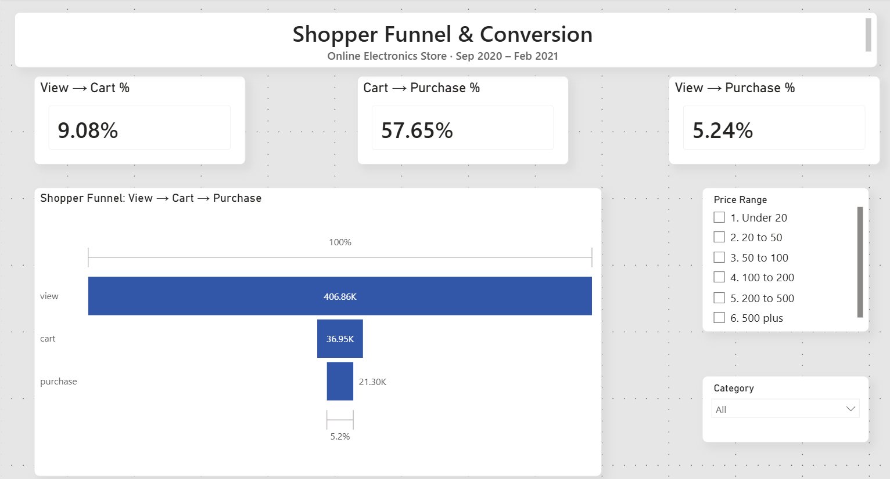
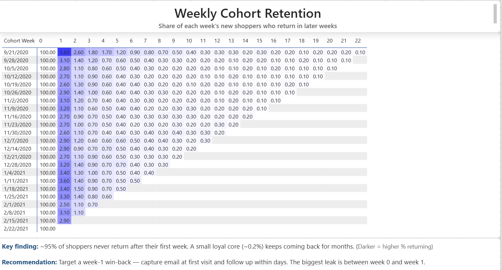

# Where Do Online Shoppers Drop Off — and Do Buyers Come Back?

A product funnel and retention analysis of a real online electronics store (~885,000 events, Sep 2020 – Feb 2021), built end-to-end with SQL, Python, and Power BI.

---

## The Business Question

**Where do online shoppers drop off between viewing a product and buying it, and do buyers come back over time?**

Supporting questions:
- What is the conversion rate at each funnel step (view → cart → purchase)?
- Which categories, brands, and price ranges convert best and worst?
- Of shoppers active in their first week, what share return in later weeks?

---

## Key Findings

**1. The biggest leak is at the very top of the funnel.**
Only **9.08%** of shoppers who view a product ever add one to cart - about 370,000 people browse and leave. But once a product is in the cart, **57.65%** get purchased. The checkout experience is healthy; the problem is converting browsers into carters.

**2. Conversion varies enormously by category and brand.**
PC-component categories and brands (video cards, sapphire, msi, gigabyte) convert at ~12–16%, while several appliance/home lines convert below 1%. The store's real strength is computer hardware.

**3. Mid-priced products convert best.**
The €200-500 price band converts at **7.09%**, well above the ~4-5% seen in every other band. Cheaper products do not convert better despite the lower commitment.

**4. Retention is a "leaky bucket."**
About **95% of shoppers never return after their first week.** Week-1 retention sits at ~2.5-3.6% across every weekly cohort for five straight months, showing no improvement over time. A small loyal core (~0.2%) keeps returning for months.

---

## Recommendations

- **Fix the view→cart step first.** With ~370,000 shoppers lost here, even a small improvement outweighs any checkout optimization. Strengthen product pages, make "Add to Cart" prominent, add recommendations.
- **Lean into computer hardware.** Feature the categories and brands that already convert well; investigate (don't just advertise) the sub-1% lines.
- **Prioritize the €200–500 range** in merchandising, where both conversion and volume are strong.
- **Launch a week-1 win-back.** Because the biggest retention drop is between week 0 and week 1, capture emails at first visit and follow up within days. Fix retention before scaling acquisition - there's no value adding new visitors while 95% leak out.

---

## Dashboard

### Overview — Funnel & Conversion


### Retention — Weekly Cohorts


---

## Tools & Data

- **PostgreSQL** - stored the ~885K events and ran all funnel and cohort SQL.
- **Python (pandas, NumPy)** - reshaped the cohort data and computed retention rates.
- **Power BI** - interactive dashboard (funnel, KPI cards, cohort heatmap, slicers).
- **Data:** ["eCommerce events history in electronics store" (Kaggle, by mkechinov)](https://www.kaggle.com/datasets/mkechinov/ecommerce-events-history-in-electronics-store). Raw data not hosted here (see Kaggle link); each row is one event - a view, cart, or purchase.

---

## How It Was Built (Technical Notes)

**Funnel (SQL).** Counted **distinct users** (not events) at each stage, so a shopper who viewed 40 products counts once, not 40 times - the honest way to measure people progressing through a funnel. Conversion rates and category/brand/price breakdowns were computed in PostgreSQL.

**Retention (SQL + Python - deliberately split).**
- **SQL** did the heavy aggregation inside the database: it found each user's first week (`DATE_TRUNC`), tagged every event with weeks-since-first, and produced a small summary of unique users per (cohort, week). This shrinks 885K rows to ~276 before anything leaves the database.
- **Python (pandas/NumPy)** reshaped that small summary into a cohort matrix (`pivot_table`) and divided each row by its week-0 value to get retention percentages.
- **Why split it this way:** the database handles scale efficiently; pivoting and row-wise division are cleaner in pandas. Right tool for each job.

**Dashboard (Power BI).** The funnel and KPI cards use live DAX measures (`CALCULATE` + `DISTINCTCOUNT`) so they recalculate when slicers are applied; the retention heatmap uses conditional formatting driven by a measure to color cells by value.

**Data verification.** Before analysis, the raw CSV was inspected with a Python script (`peek.py`) - checking column names, row count, and date range - to confirm the data spanned enough weeks for weekly cohorts rather than assuming it.

---

## Repository Structure

```
├── sql/         SQL queries (funnel analysis, retention cohorts)
├── python/      Python retention script + input/output CSVs
├── powerbi/     Power BI dashboard (.pbix)
├── images/      Dashboard screenshots
└── data/        (DATA_SOURCE.md - raw data linked to Kaggle, not hosted)
```
